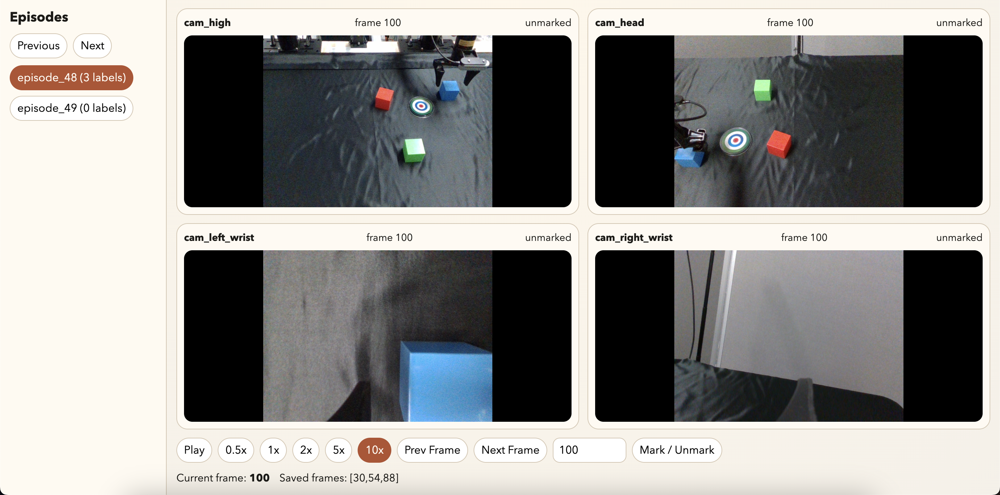

# Subgoal-label-for-Robolatent

Local browser app for annotating zero-based subgoal-complete frame indices across four synchronized camera views and exporting `cam_high` frames from episode HDF5 files.

The browser viewer uses the canonical image arrays stored in the HDF5 files for all four cameras. It does not rely on browser MP4 playback for annotation.

## Setup

### Option 1: Conda (recommended)

This is the most reliable path for `h5py`/HDF5 on this project.

```bash
source activate base
conda create -y -p ./.conda-env python=3.11 pytest h5py pillow flask
conda activate /absolute/path/to/Subgoal-label-for-Robolatent/.conda-env
python -m pip install -e .
```

### Option 2: venv

```bash
python -m venv .venv
source .venv/bin/activate
python -m pip install --upgrade pip
python -m pip install -e ".[dev]"
```

## Run

The app defaults `DATASET_DIR` to the parent directory of the repo checkout. Override it if your episode files live somewhere else.

```bash
export DATASET_DIR=/absolute/path/to/episode/files
python -m app.main
```

Then open `http://127.0.0.1:5000`. You will see



## Verify

For the conda path:

```bash
.conda-env/bin/python -m pytest -q
node --test frontend-tests/player-controller.test.mjs
```

For the venv path:

```bash
.venv/bin/python -m pytest -q
node --test frontend-tests/player-controller.test.mjs
```

## Notes

- `.conda-env/` and `.venv/` are local environment directories and are intentionally ignored. Other users should create their own env instead of copying yours.
- The shared annotations file is expected at `${DATASET_DIR}/annotations.json`.
- The annotation UI loads per-frame PNGs on demand from the HDF5 camera datasets under `/observations/images/`.
- Extracted `cam_high` frames are written under `${DATASET_DIR}/extracted_frames/`.
